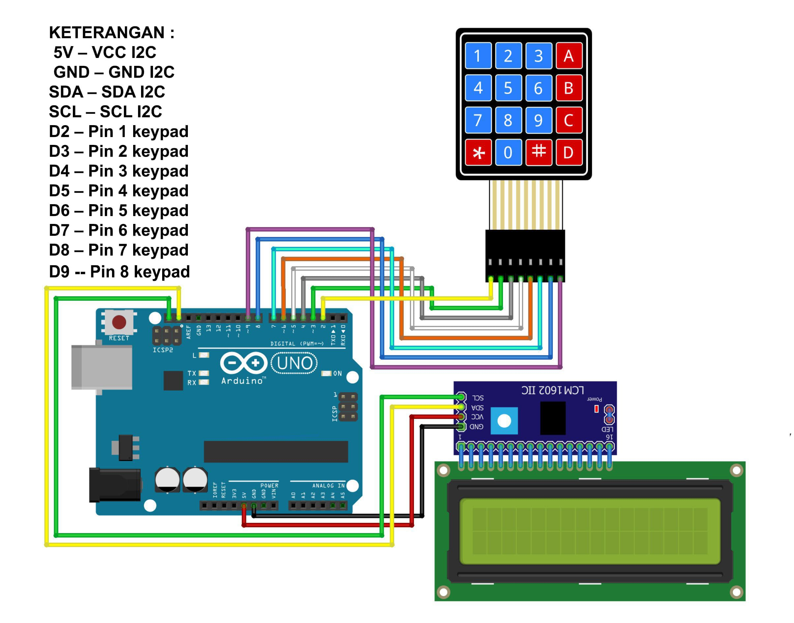

# Arduino Password Entry System with Keypad and LCD Display

This project is an Arduino-based password entry system that uses a 4x4 keypad for input and a 16x2 I2C LCD display to show messages. The system allows users to input a password, which is then validated against a predefined password. If the password is correct, an LED lights up as a signal of successful access.

## Description

This project is designed to demonstrate a simple password protection system using an Arduino, a keypad, and an LCD display. The user inputs a numerical password via the keypad, which is then compared to a stored password. The LCD provides real-time feedback, displaying messages such as "Input Password," "Access Accepted," or "Invalid Password." The system is ideal for basic security implementations or educational purposes.

## Components Required

- Arduino IDE or VS Code;
- Library I2C LCD;
- Library Keypad;
- Arduino Uno = 1 piece;
- 4x4 Keypad = 1 piece;
- 16x2 I2C = 1 piece;
- 16x2 LCD Display = 1 piece;
- LED on Boar Arduino pin 13;
- Breadboard = 1 piece;
- Jumper Wires.

# Schematic:

- Below you can see a schematic image to facilitate the wiring of cables from the microcontroller to devices, both input and output sensors:

## Circuit Diagram

- **Keypad**:
  - Row pins: Arduino pins 2, 3, 4, 5
  - Column pins: Arduino pins 6, 7, 8, 9
- **I2C LCD**:
  - SDA to Arduino A4
  - SCL to Arduino A5
  - VCC to 5V
  - GND to GND
- **LED**:
  - Positive lead to Arduino pin 13
  - Negative lead to GND

## Work steps

- Prepare the tools and materials to be used.
- Carry out the wiring process using Figure schematic of the above circuit.
- Open the Arduino IDE software that has been installed on laptop/computer.
- Download all the libraries above and insert the library by opening the Arduino IDE, selecting Sketch > Include Library -> Add.Zip Library.
- Type the program sketch on the Arduino IDE page.
- Enter the I2C LCD address in the sketch program.
- Carry out the process of uploading the program.

## Features

- **Password Input**: Allows users to enter a multi-digit password.
- **Validation**: Compares the entered password with a predefined one.
- **Feedback Display**: Provides feedback on the LCD whether access is granted or denied.
- **LED Indication**: Lights up an LED when the correct password is entered.

## Code Explanation

### Initialization

- The `Keypad` and `LiquidCrystal_I2C` libraries are used to manage keypad input and LCD output.
- The LCD is initialized and backlight is turned on for clear visibility.
- The predefined password is set as `1379`.

### Main Loop

- The system prompts the user to input a password via the LCD.
- **Numbers (0-9)**: Accumulate the entered digits as the password.
- **`#` Key**: Validates the entered password against the stored password.
  - If correct, "Access Accepted" is displayed and the LED lights up.
  - If incorrect, "Invalid Password" is displayed.
- **`*` Key**: Resets the input if the user wants to re-enter the password.

## How to Use

1. Power the Arduino and ensure all components are connected properly.
2. Enter the password using the keypad.
3. Press `#` to submit the password.
4. If the password is correct, the LCD will display "Access Accepted" and the LED will turn on briefly.
5. If the password is incorrect, the LCD will display "Invalid Password." Press `*` to clear the input and try again.

## Example

To enter the correct password `1379`:

1. Press `1`, `3`, `7`, `9` on the keypad.
2. Press `#` to validate.
3. The LCD will display "Access Accepted" and the LED will turn on.

## Notes

- Ensure the keypad and LCD are wired correctly according to the pin configuration.
- The default password is set to `1379`, but it can be changed in the code.

## Conclusion:

- The program works by asking us to enter a password to be able to access, Previously, the access password had been set first in the program. If the password is entered is correct then the LCD will display "Access Accepted" If the password is incorrect the LCD screen will display “Invalid Password".
